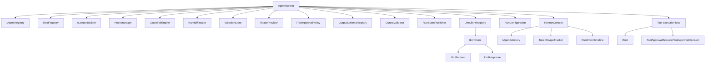
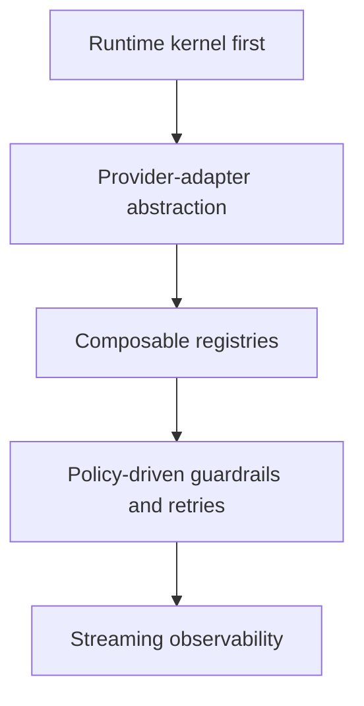
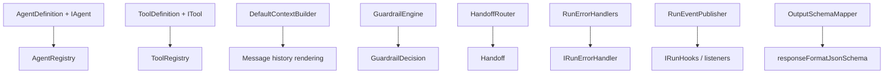
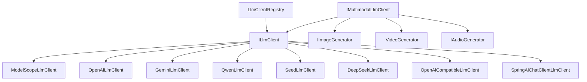
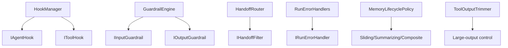
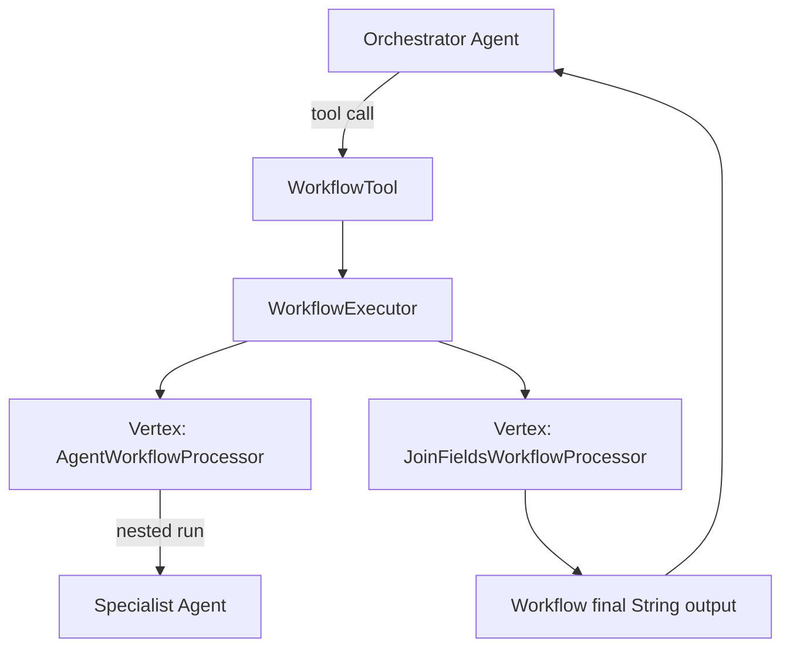

# GUNDAM-core Project Architecture and Code Structure

## 1. Runtime Architecture (Current State)

### Execution contract

`AgentRunner` is the orchestration center. Each run initializes a `RunnerContext`, loads optional session history into memory, and iterates turn-by-turn until termination. A turn may end in one of three paths:

1. **Tool path**: model returns tool calls -> approval policy -> tool execution -> tool outputs are appended -> continue loop.
2. **Handoff path**: model returns `handoffAgentId` -> `HandoffRouter` validates allow-list/filter -> current agent switches -> continue loop.
3. **Finalization path**: model returns final content/structured output -> optional schema validation -> session persistence -> `ContextResult`.

## 2. Design Principles

### Practical interpretation in this codebase

- **Kernel first**: core modules define contracts and orchestration, not app logic.
- **Provider abstraction**: every model integration goes through `ILlmClient`; multi-provider routing is handled by `LlmClientRegistry`.
- **Composable registries**: agents/tools/schemas/processors are all registry-driven.
- **Policy-driven safety**: guardrails, retries, tool approvals, and error handlers are pluggable.
- **Streaming observability**: token/reasoning deltas, lifecycle events, and spans are first-class runtime outputs.

## 3. Key Components

### Core package map

- **runner**: runtime loop (`AgentRunner`) and run knobs (`RunConfiguration`)
- **agent**: declarative agent model + registry + chat facade
- **tool**: typed tools, runtime execution, built-ins (agent/workflow/computer/patch/etc.)
- **llmspi**: provider abstraction, request/response model, streaming listener, adapter implementations
- **memory/session/context**: message history management + session persistence boundaries
- **events/streaming/tracing**: runtime visibility and telemetry
- **workflow**: DAG runtime and processors
- **mcp**: MCP client manager and proxy tooling
- **rag/multimodal/realtime/voice**: advanced capability interfaces and selected implementations

## 4. Provider Agnostic Layer

### Why this matters

- Model vendors can be swapped without changing `AgentRunner` logic.
- Multi-provider runs (including handoff across providers) are enabled by agent-level provider selection + `LlmClientRegistry`.
- Streaming and non-streaming flows share the same normalized `LlmResponse` contract.

## 5. Extension Points

### Extension strategy

GUNDAM-core favors interface boundaries over inheritance-heavy frameworks. Most customizations are injected through constructor/builder wiring:

- runtime hooks (`IRunHooks`, `IAgentHook`, `IToolHook`)
- policy objects (`RetryPolicy`, `IToolApprovalPolicy`, memory lifecycle policies)
- registries (agents/tools/output schemas/workflow processors)
- provider adapters (`ILlmClient`)
- backend abstractions (`ISessionStore`, `IAgentMemory`, context-service memory store)

## 6. Agent and Workflow Composition Patterns

### Composition rules

- **Agent as a tool**: `AgentTool` wraps an agent invocation so another agent can delegate using normal tool-calling.
- **Workflow as a tool**: `WorkflowTool` exposes a workflow DAG as an agent-callable tool.
- **Agent as a workflow step**: `AgentWorkflowProcessor` executes one vertex by delegating to an agent.
- **Workflow result contract**: workflow output is normalized to final `String` for immediate agent consumption.

## 7. Data Flow Details (Added)

### 7.1 Memory/session flow

1. `RunConfiguration.sessionId` is checked.
2. If present, `ISessionStore.load(sessionId)` hydrates prior messages into memory.
3. Each new message/tool output is appended to `IAgentMemory`.
4. Memory lifecycle policy can compact/summarize/isolate after appends.
5. Final memory snapshot is persisted back through `ISessionStore`.

### 7.2 Streaming flow

- `runStreamed(...)` wires an `ILlmStreamListener`.
- Delta callbacks publish `MODEL_RESPONSE_DELTA` and optional `MODEL_REASONING_DELTA`.
- Tool call fragments and token usage are captured and merged into final `LlmResponse`.
- The return value remains deterministic (`ContextResult`), so callers can choose streaming without changing completion handling.

### 7.3 Structured output flow

- Structured output may come from prompt schema or class schema (`OutputSchemaMapper`).
- `OutputValidator` checks the final structured payload.
- Failures add system timeline items and continue loop/recovery logic rather than returning invalid payloads.

## 8. Package-level Implementation Status (Added)

- **Mature/production-shaped**: runner, tool system, agent registry, handoff, guardrail, tracing/events, approvals, output schema validation.
- **Feature-complete but evolving**: workflow DAG runtime, MCP subsystem, RAG/vector store, computer/editor tools.
- **Scaffolding/partial**: realtime and voice pipeline interfaces, multimodal generation provider implementations.

This split mirrors the repository goal: fully usable core runtime with clear extension seams for progressively implemented modalities and transports.
